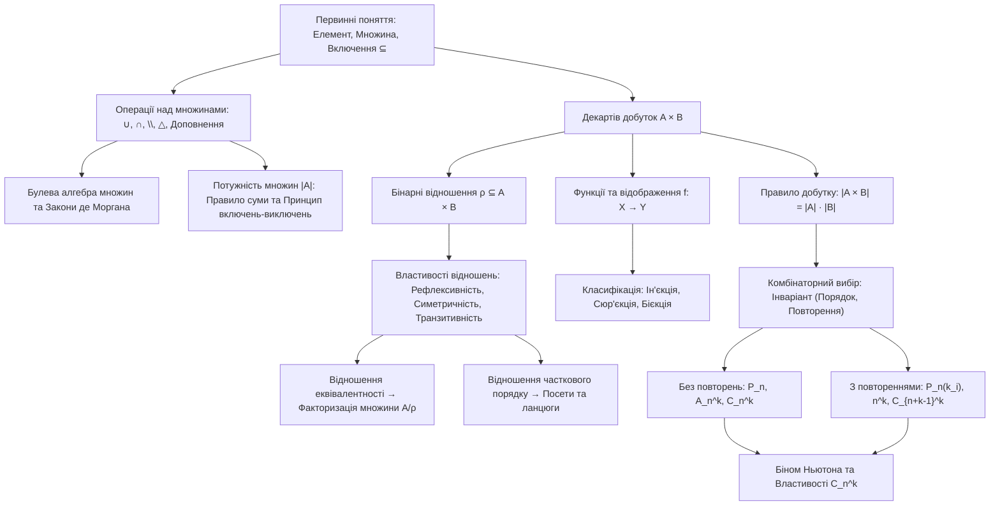

# 🎓 Навчальний план модуля: Теорія множин, відношення та комбінаторика

> **Формат**: Парне навчання «Студент + ШІ-наставник» (Socratic Pair Learning & Mathematical Inquiry)  
> **Аудиторія**: 2 курс (спеціальність «Штучний інтелект та аналіз даних» / комп'ютерні науки).  
> **Загальний таймінг**: 240 хвилин (4 астрономічні години із 3 перервами по 10 хвилин).  
> **Першоджерела**: Лекційні матеріали курсу вищої математики.

---

## 🏛️ 1. Ключові педагогічні інваріанти (Learning Policy v1)

1. **Закон когнітивного суверенітету студента**:  
   ШІ-наставник ніколи не виконує остаточний крок міркування або підрахунку замість студента. Наставник ставить запитання, спрямовує увагу на порушення інваріантів, надає граничні контрприклади, але синтез формули та відповіді здійснює студент.
2. **Сократична драбина допомоги (Scaffolding L0–L5)**:
   - **L0 (Діагностика)**: Одне фокусуюче питання на встановлення базового простору (*«Чи має значення порядок вибору елементів у цій задачі?»*).
   - **L1 (Принцип)**: Озвучення універсального закону без застосування конкретних чисел (*«Якщо операція відповідає логічному 'АБО' над неперетинними множинами, діє правило суми»*).
   - **L2 (Локалізація аномалії)**: Вказівка на місце розбіжності в міркуваннях (*«Зверніть увагу: множина підмножин $2^A$ включає як порожню множину, так і саму множину $A$»*).
   - **L3 (Проміжний крок)**: Розрахунок підформули або один крок спрощення булевого виразу.
   - **L4 (Аналогічний ізоморфний кейс)**: Розбір задачі-близнюка з іншими ідентифікаторами чи числовими даними.
   - **L5 (Worked Example + Near-Transfer)**: Повне покрокове розв'язання з негайною видачею нового нерозв'язаного ізоморфного завдання для закріплення.
   - **Direct Escape Hatch (Технічний люк)**: На прямі запитання про синтаксис (наприклад, синтаксис `itertools` у Python або символи LaTeX) відповідь надається миттєво з фіксацією рівня допомоги `assistance: hints`.
3. **Протокол передбачення (Prediction-First)**:  
   Перед обчисленням значення або доведенням студент формулює гіпотезу:
   - Який комбінаторний тип конфігурації реалізується (впорядкована/невпорядкована, з поверненням/без)?
   - Яка межа потужності множини очікується?

---

## ⏱️ 2. Хронометраж та етапи проходження (240 хвилин)

```mermaid
gantt
    title Навчальний модуль: Теорія множин та комбінаторика
    dateFormat  X
    axisFormat %s хв
    section Блок 1: Множини та Операції
    Вхідний зріз знань (Diagnostic Check)   :0, 15
    Множини, Булеан, Діаграми Венна       :15, 45
    Алгебра множин та закони де Моргана    :45, 70
    section Перерва 1
    Когнітивне розвантаження 1             :70, 80
    section Блок 2: Відношення та Відображення
    Декартів добуток та бінарні відношення :80, 110
    Властивості, Еквівалентність, Порядок  :110, 135
    Відображення: ін'єкція, сюр'єкція      :135, 150
    section Перерва 2
    Когнітивне розвантаження 2             :150, 160
    section Блок 3: Комбінаторика
    Правила суми, добутку, включень-виключень :160, 185
    Конфігурації без повторень (P, A, C)  :185, 205
    Конфігурації з повтореннями (кулі/перегородки) :205, 220
    section Перерва 3
    Когнітивне розвантаження 3             :220, 230
    section Блок 4: Атестація
    Виконання контрольної форми та підсумок :230, 240
```

---

## 🧭 3. Схема переходів між темами та концептуальний граф

---

## 🎯 4. Вхідні вимоги та діагностичний зріз (Entry Check)

Перед початком роботи студент проходить експрес-опитування з 3 питань (5–10 хв):
1. **Логічні зв'язки**: Як пов'язані логічні зв'язки «ТА» ($\land$), «АБО» ($\lor$), «НІ» ($\neg$) із теоретико-множинними операціями?
2. **Факторіали**: Обчислити значення виразу $\frac{7!}{5! \cdot 2!}$ усно. Чому дорівнює $0!$?
3. **Підмножини**: Скільки підмножин має множина $\{a, b, c\}$? Записати їх усі.

---

## 📦 5. Навігація по файлах модуля

| Файл | Призначення |
| :--- | :--- |
| [`01_Теоретичний_конспект.md`](01_Теоретичний_конспект.md) | Фундаментальний конспект з математичними доведеннями, діаграмами та KaTeX. |
| [`02_Інтерактивний_симулятор_Генеративний_UI.html`](02_Інтерактивний_симулятор_Генеративний_UI.html) | Інтерактивна лабораторія: візуалізація операцій над множинами, матриць відношень та комбінаторики. |
| [`03_Практикум_та_Задачник.md`](03_Практикум_та_Задачник.md) | Покрокові розбори типових практичних задач та прикладні кейси в IT/Python. |
| [`04_Контрольні_форми_та_Рубрика.md`](04_Контрольні_форми_та_Рубрика.md) | Критеріальна рубрика оцінювання (1–4), 3 взаємно незалежні форми варіантів (A, B, C) та еталони. |
| [`05_Anki_Cards_Retrieval_Deck.md`](05_Anki_Cards_Retrieval_Deck.md) | Комплект карток активного пригадування зі стабільними UUID для синхронізації з Anki (FSRS). |
| [`06_Zettelkasten_Синтез.md`](06_Zettelkasten_Синтез.md) | 3 дистильовані постійні нотатки для інтеграції в персональну базу знань Second Brain. |
